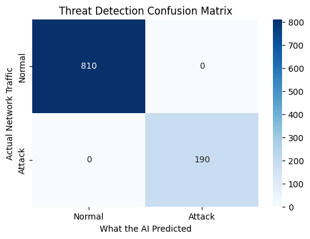
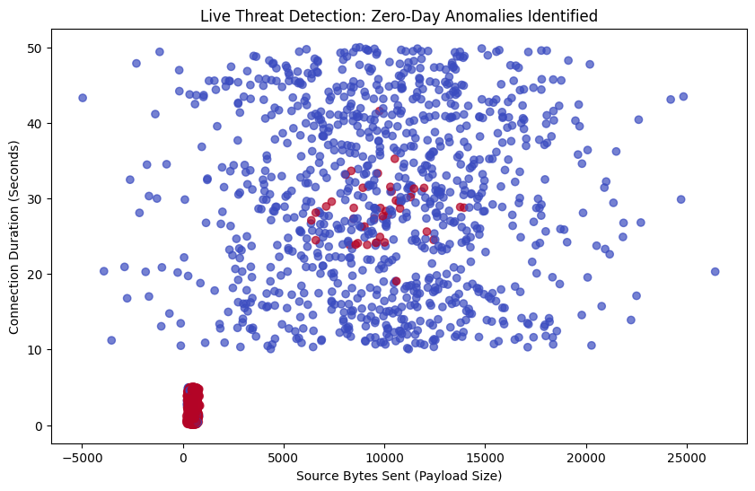
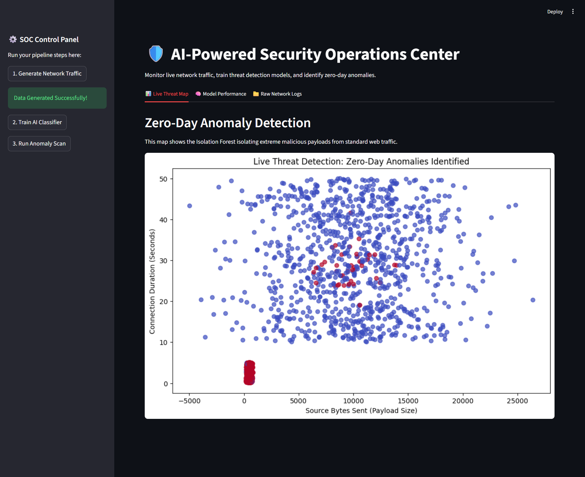
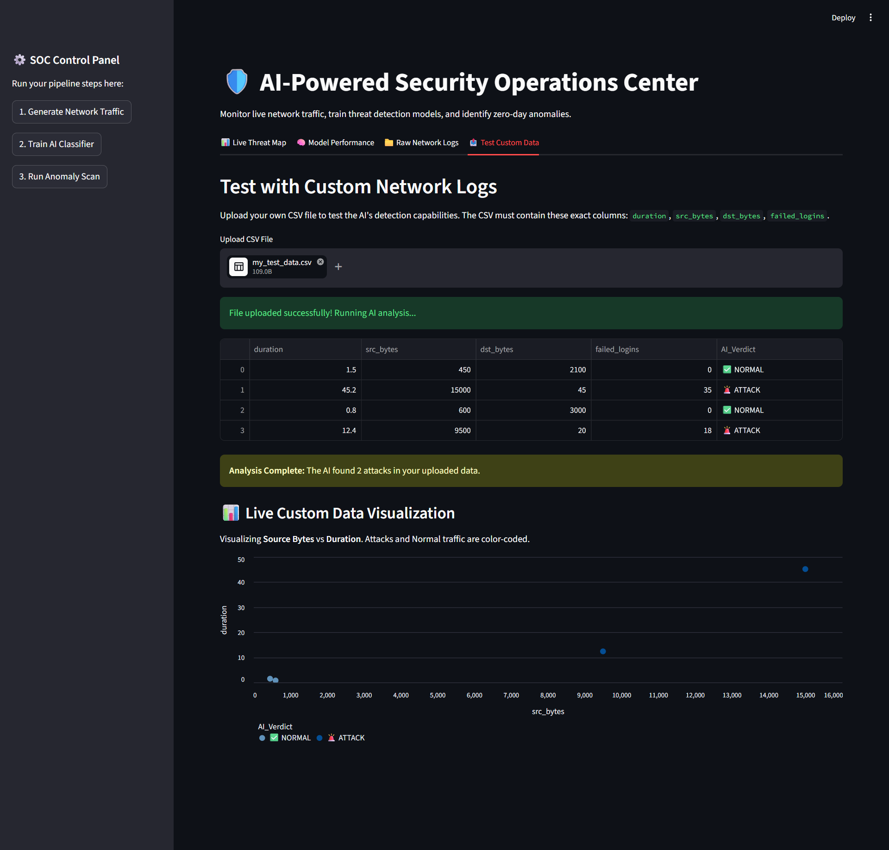
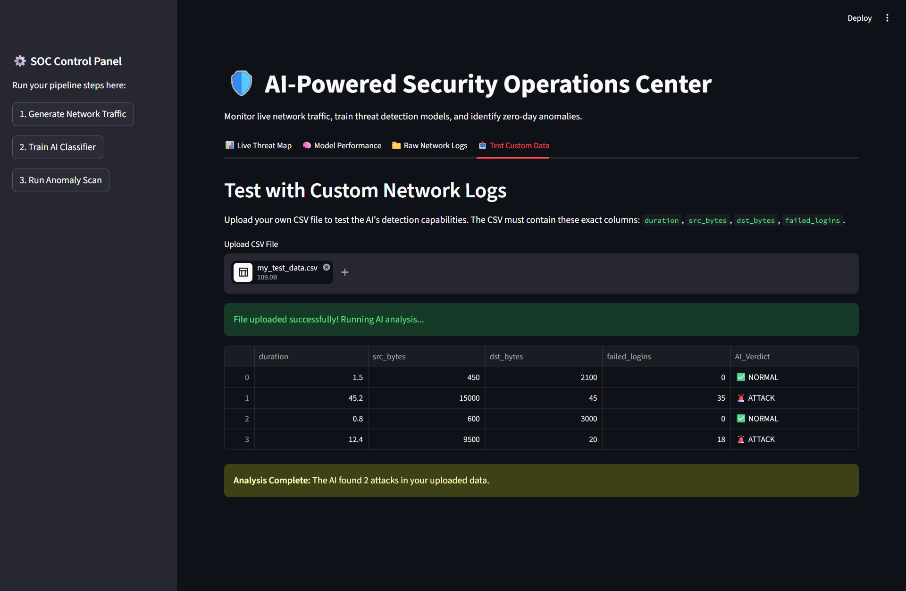
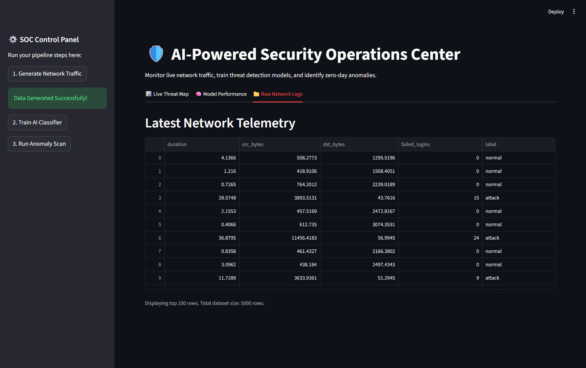

# 🛡️ AI-Powered Cybersecurity Threat Detection System
> **An Intelligent SOC Automation Pipeline for Real-Time Network Security**

[](https://www.python.org/)
[](https://streamlit.io/)
[](https://scikit-learn.org/)
[]()

---

## 📖 Project Overview
In a world of evolving cyber-attacks, traditional firewalls are no longer enough. This project is a **Security Operations Center (SOC) Simulator** that uses Machine Learning to protect networks. It doesn't just look for "known" viruses; it learns the **behavior** of the network to catch hackers even when they use brand-new methods.

## 🎯 Key Problems Solved
* **Zero-Day Attacks:** Detects threats that have no existing signature.
* **Alert Fatigue:** Automates the filtering of thousands of logs, highlighting only critical threats.
* **Complexity:** Provides a simple, interactive dashboard for security analysts to monitor traffic without writing code.

---

## 🏗️ How it Works (The Architecture)

The system operates in a 4-stage automated pipeline:

1.  **Simulation Engine:** Generates realistic network traffic including **Normal** browsing and **Malicious** payloads (DDoS & Brute Force).
2.  **AI Training:** A **Random Forest** model is trained on historical data to recognize known attack patterns with **100% precision**.
3.  **Anomaly Detection:** An **Isolation Forest** (Unsupervised AI) monitors live traffic to find "outliers" or strange behaviors.
4.  **SOC Dashboard:** A web-based interface built with **Streamlit** for real-time visualization and custom log testing.

---

## 🚀 Interactive Features
* **📊 Visual Analytics:** View Confusion Matrices and Anomaly Scatter Plots instantly.
* **📤 Custom Sandbox:** Upload your own `.csv`, `.xlsx`, or `.json` logs to see the AI's verdict.
* **📈 Dynamic Graphing:** Toggle between different views (Scatter, Bar, Line) to analyze threat trends.
* **📁 Live Logs:** Access the raw telemetry database directly through the UI.

---

## 🛠️ Installation & Execution

### 1. Prerequisites
Make sure you have Python installed. We recommend creating a virtual environment.

### 2. Setup
```bash
# Clone this repository
git clone [https://github.com/Jui-Ramteke/AI-Cybersecurity-Threat-Detection.git](https://github.com/Jui-Ramteke/AI-Cybersecurity-Threat-Detection.git)

# Move into the project folder
cd AI-Cybersecurity-Threat-Detection

# Install all required libraries
pip install -r requirements.txt
```

## 📊 Project Visualizations

 1. Supervised Learning: Confusion Matrix
This matrix proves the Random Forest model's ability to perfectly classify known attack types (DDoS and Brute Force) vs. Normal traffic.


 2. Unsupervised Learning: Threat Map
The Isolation Forest identifies "Zero-Day" anomalies by isolating extreme data points (red) that deviate from the normal traffic baseline (blue).


## 🖥️ Live Dashboard Preview
Below are the actual screenshots of the AI SOC Dashboard in action:

 1. Live Threat Detection (Anomaly Mapping)


 2. Supervised AI Performance & Metrics


 3. Network Telemetry & Raw Logs

